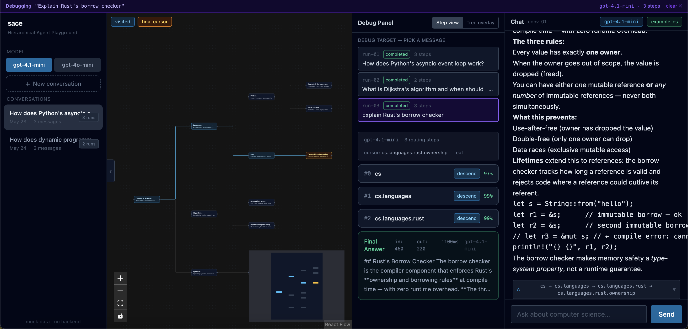

# SACE — *Small Agent, Context Engineered*

> Can a **small model** become useful if we stop one-shotting it and instead let it
> *walk* a pre-structured tree of knowledge — one small, local decision at a time?

SACE is a research playground for that question. The bet:
**spread the data, spread the decisions.** Don't hand a tiny model a flat ocean of
chunks and ask it to find the answer. Hand it a **dendrogram** — a hierarchy where
the topic narrows level by level — and let it zoom in, the way you zoom into
Google Maps: continent → country → city → street.


## The idea in one paragraph

Knowledge has **hierarchy** and **boundaries**, and those boundaries are easy to
spot from a top-down view. Instead of asking the model to *construct* structure
out of flat text, we give it a structure that already exists and ask it to *use*
it. At each step the model sees only the current node and its direct children,
makes one local routing decision (`descend(child_id)` or `stop`), and moves on.
Context accumulates slowly, like an illumination process — general first, then
specific. A dendrogram also makes a second point visible: **a large system is
built from many small ones.** Even if the small model has never heard of a term,
it can recognize what that term is *made of*, because the ingredients are its
children.

The full thesis lives in the docs:

- [docs/00-overview/05-the-idea.md](docs/00-overview/05-the-idea.md) — why spread > one-shot
- [docs/00-overview/06-progressive-zoom.md](docs/00-overview/06-progressive-zoom.md) — the Google-Maps zoom metaphor
- [docs/00-overview/07-emergence-from-ingredients.md](docs/00-overview/07-emergence-from-ingredients.md) — small systems compose into larger ones

## The debugger

Because the reasoning *is* the product, the UI gives equal real estate to the
trace. Two synchronized views — chat-style (turn-by-turn list) and tree-overlay
(route on the map) — show the same run from different angles. Pick any past
message and replay how the agent got there.



More on this in [docs/00-overview/01-vision.md](docs/00-overview/01-vision.md)
and [docs/06-frontend/04-debug-panel.md](docs/06-frontend/04-debug-panel.md).

## Quick start

```bash
# Backend
uv sync --group dev
make dev-backend   # http://localhost:8000

# Frontend (separate terminal)
cd frontend && npm install && npm run dev   # http://localhost:5173
```

## Layout

- `backend/sace/` — Python package (FastAPI, LangGraph, schemas)
- `frontend/` — React + Vite SPA
- `data/trees/` — example knowledge trees (JSON, seeded into SQLite at boot)
- `docs/` — design, architecture, and the idea writeups
- `assets/` — figures used in the docs

## Make targets

| Target | Description |
|--------|-------------|
| `make dev-backend` | Uvicorn with reload |
| `make dev-frontend` | Vite dev server |
| `make test` | pytest |
| `make seed` | Load trees from `data/trees/` |
| `make types` | Regenerate frontend types stub |

## Status

Experimental. Mini-tier models only (`gpt-4.1-mini`, `gpt-4o-mini`) — the
constraint is the experiment. If small models can't route a well-shaped tree,
that itself is the finding.
