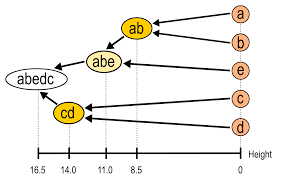

# Emergence from ingredients — large systems from small parts

A dendrogram does two things at once. Most of the docs talk about the first.
This page talks about the second.

1. **Zoom.** A path from root to leaf is *general → specific*. (Covered in
   [06-progressive-zoom.md](./06-progressive-zoom.md).)
2. **Composition.** A node *is* its children — the children are the parts the
   node is built from. Read from the leaves *up*, the tree shows how small
   systems compose into larger ones.



The picture above is the classic agglomerative view: `a` and `b` merge into
`ab`; `ab` and `e` merge into `abe`; `c` and `d` merge into `cd`; finally
`abe` and `cd` merge into `abedc`. The whole is, very literally, the sum of
its parts.

## Why composition matters for a small model

The hypothesis side of SACE is mostly "spread the decisions" (see
[05-the-idea.md](./05-the-idea.md)). But there is a quieter, second hypothesis
that the dendrogram structure unlocks:

> **A small model that does not know a *term* can still reason about it through
> the things it is made of.**

Concretely: suppose the agent arrives at a node titled *"Rust's borrow
checker"* and the model has only a faint idea what that means. The node has
children — `ownership`, `lifetimes`, `references`, `move semantics`. Each
child's description is something the model *does* understand at its level.

The model does not need a perfect prior for "borrow checker" as a concept. It
needs to recognize that the user's query is about *one of those ingredients*,
and zoom into that one. The unknown whole is approached through the known
parts.

This is also why the tree-overlay view ([../06-frontend/05-tree-overlay-debug.md](../06-frontend/05-tree-overlay-debug.md)) is
genuinely informative and not just decorative: when the model successfully
navigates a topic it doesn't really "know", you can see it happen — the route
goes through the ingredients, not through any prior knowledge of the parent.

## Two reading directions, one structure

The same tree, read two ways, gives the agent two different superpowers:

| Direction | What it gives the agent | Used during |
|---|---|---|
| Top-down (root → leaves) | Progressive narrowing, bounded context | Traversal at query time |
| Bottom-up (leaves → root) | Composition: what a thing is *made of* | Disambiguation at query time, and authoring time |

The agent's loop is top-down. But the *meaning* of any parent node is
implicitly defined by its children — so even when traversing top-down, the
model is using the children to interpret the parent. The compositional view
is always present, even if we never explicitly walk it that way.

## How this changes how you author a tree

If you accept this framing, two authoring rules drop out:

1. **A node's children should be the ingredients you'd describe the node by
   if you had to explain it without using its name.** If the only way to
   describe `borrow checker` is "the borrow checker", the children are wrong.
   They should be the underlying mechanics (`ownership`, `lifetimes`, ...).
2. **Sibling nodes should be roughly orthogonal *and* roughly equally
   weighted as ingredients.** If one child carries 90% of the meaning of the
   parent, the tree is degenerate — the parent should probably collapse into
   that child, or the other siblings should be promoted.

These are not aesthetic rules. They are the conditions under which a small
model can reason about an unfamiliar node by descending into ingredients it
*does* recognize.

## The relationship to embeddings

A vector index encodes "what is similar to what". A dendrogram encodes
"what is built from what". Those are different relations.

- Similarity (embeddings) is **flat and metric** — every pair of chunks has a
  distance.
- Composition (dendrograms) is **hierarchical and asymmetric** — a child
  contributes to a parent, but the parent does not symmetrically contribute
  back.

For a small model, the asymmetric, hierarchical view is the more useful one,
because it tells the model *where to go next* — which an isotropic similarity
score cannot.

## A small example

Imagine a tree for cooking:

```
cooking
├── techniques
│   ├── braising
│   ├── searing
│   └── emulsifying
├── ingredients
│   ├── proteins
│   ├── fats
│   └── acids
└── dishes
    ├── stews
    └── sauces
```

Ask: *"why does my pan sauce break?"*

A flat retriever might return "emulsifying" and "sauces" as top-k, and a small
model would have to figure out the connection from scratch. The tree agent
zooms: `cooking` → `techniques` → `emulsifying`, then maybe cross-checks
`ingredients/fats`. The route itself is the explanation: *a pan sauce breaks
because emulsification of fats fails*. The model never had to know that
beforehand — the structure walked it there.

That is the second hypothesis SACE is trying to make observable.

## Related reading

- The main thesis: [05-the-idea.md](./05-the-idea.md).
- The user-facing metaphor: [06-progressive-zoom.md](./06-progressive-zoom.md).
- Node schema (why `description` matters more than you'd think): [../02-data-model/01-node-schema.md](../02-data-model/01-node-schema.md).
- How children get rendered into the routing prompt: [../04-context-engineering/01-xml-tree-format.md](../04-context-engineering/01-xml-tree-format.md).
